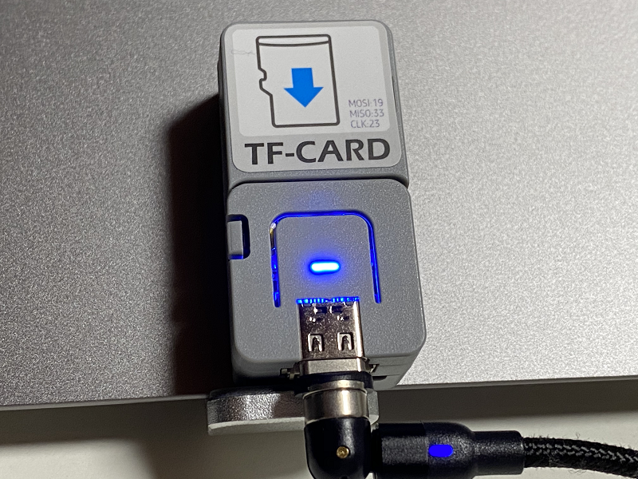
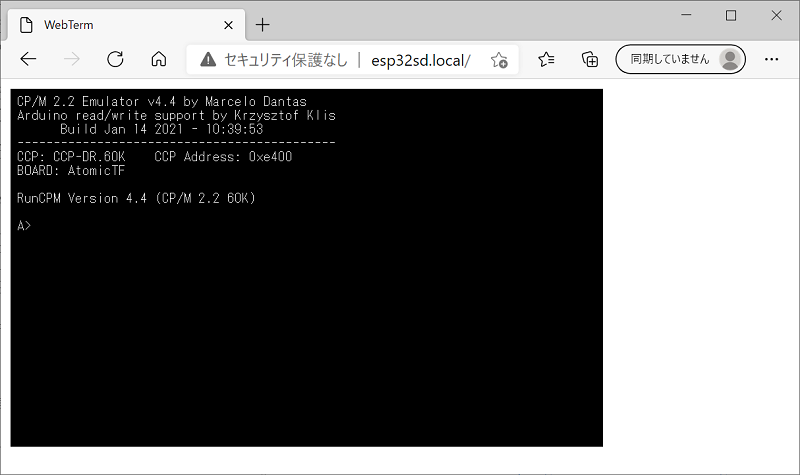

# AtomicTF_RunCPM_WebTerm
ATOMIC TFカードキットで動く超小型CP/Mマシン

  

これは、RunCPMをM5Stack ATOMIC TFカードキットで動くようにしたものです。 
スマホ、PC等とブラウザで接続して使用します。(iPhone11で動くことを確認しました。)

オリジナルはこちら。 
RunCPM - Z80 CP/M 2.2 emulator <https://github.com/MockbaTheBorg/RunCPM> 
term.js <https://github.com/chjj/term.js/> 

---

### 必要な物 ###
* [ATOMIC TFカードキット](https://www.switch-science.com/catalog/6475/ "Title") 
* Arduino IDE (1.8.13で動作確認をしました。) 
* [Arduino core for the ESP32](https://github.com/espressif/arduino-esp32 "Title")
* [SDdFatライブラリ](https://github.com/greiman/SdFat "Title") (1.1.4で動作確認をしました。2.x.xではコンパイルエラーになります。)
* [FastLEDライブラリ](https://github.com/FastLED/FastLED "Title")
* microSD カード (16GB以下のもの)

ライブラリはArduino IDEの[スケッチ | ライブラリをインクルード |ライブラリを管理...] からインストールすると簡単です。

---

### 使用方法 ###
1. スケッチのssidとpasswordを自分の環境に合わせて書き換えます。
2. 参考資料を基にmicroSDカードにRunCPM用のディスクを作ります。
3. microSDカードのルートにdataフォルダの中のファイルをコピーします。 
4. Microsoft Edgeなどのブラウザで"http://esp32sd.local/"にアクセスします。 
* Google Chromeだと表示速度が非常遅くなります。
* Android端末ではキー入力が上手くいきませんでした。
5. 接続が上手くいけばこのような画面が表示されます。 
(画面が表示されるまで少し時間が掛かります。)  
  
6. 接続が上手くいかなかったときは、シリアルモニタでIPアドレスを確認してIPアドレスでアクセスしてみてください。  
 

---

### 参考資料 ###
RunCPM用のディスクの作り方などは、DEKO（@ht_deko）さんのこちらの記事を参照してください。 

* [RunCPM (Z80 CP/M 2.2 エミュレータ)](https://ht-deko.com/arduino/runcpm.html "Title")   

